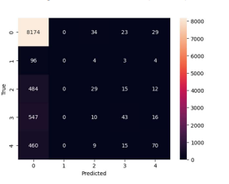
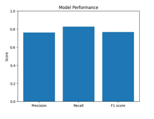
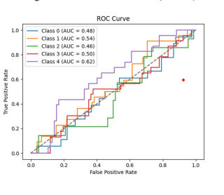
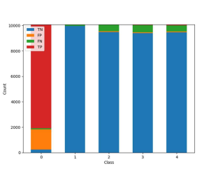
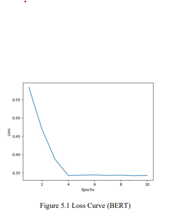
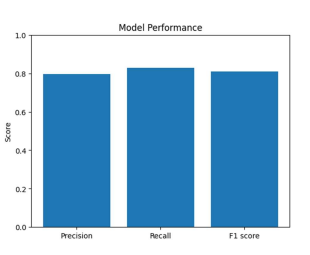
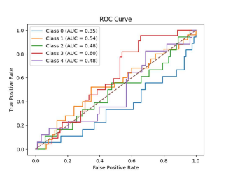
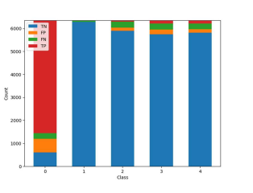

# Project

### Description

In this project we built classification models for low-resource language like Tamil, Kannada, 
Malayalam with both KL-NF techique and BERT for finding offensiveness in a sentence. We developed 
language independent model that can work for any language and for small and large datasets. 
We used datasets of 3 languages to train and test the model. After training the model, we have 
tested the model and compared the results of both KL-NF and BERT. The comparison among 
the accuracy shows that BERT model beat KL-NF in multi-lingual classification of 
offensiveness. The accuracy for BERT model is 82.7% whereas for KL-NF model is 82.5%. 

# RESULTS

## KL-NF Technique 

### Loss Curve

### Confusion Matrix

### Model Performance

### ROC Curve

### TP, TN, FP, FN for each label

## BERT

### Loss Curve for BERT model

### Confusion Matrix

### Model Performance

### ROC Curve

### TP, TN, FP, FN for each label

